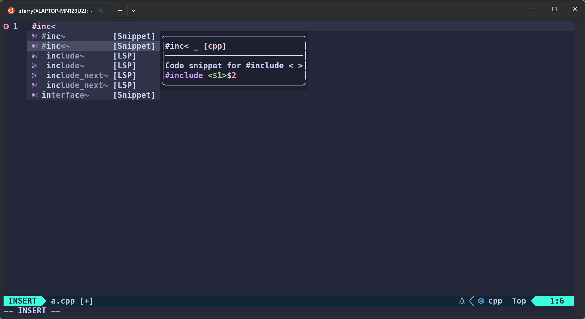

# 使用说明

[Neovim >= v0.8.0](https://github.com/neovim/neovim/releases)

# 快速开始

运行图



安装 neovim

```bash
#  找到非标准源
sudo add-apt-repository ppa:neovim-ppa/unstable
# 更新
sudo apt update
# 安装
sudo apt install neovim
```

安装所需依赖

```bash
# nodejs
curl -sL https://deb.nodesource.com/setup_20.x | sudo -E bash -
sudo apt install nodejs
# gcc clang unzip python protobuf
sudo apt install gcc clang unzip python3-venv protobuf-compiler
# cargo
curl https://sh.rustup.rs -sSf | sh 
source $HOME/.cargo/env

# wsl下
# 设置vim.opt.clipboard = "unnamedplus" wsl下 nvim启动变慢解决
curl -sLo/tmp/win32yank.zip https://github.com/equalsraf/win32yank/releases/download/v0.1.1/win32yank-x64.zip
unzip -p /tmp/win32yank.zip win32yank.exe > /tmp/win32yank.exe
chmod +x /tmp/win32yank.exe
sudo mv /tmp/win32yank.exe /usr/local/bin/
sudo rm -rf /tmp/win32yank.zip
```

安装本项目

```bash
mkdir ~/.config
cd ~/.config
git clone https://github.com/StarryDecade/Neovim-config.git
mv Neovim-config nvim
cd nvim
# 这里会黑屏正常现象，在下载插件，多进入几次。
nvim init.lua

# telescope 出错 
If you're using the LazyVim plugin manager for Neovim, follow these steps:

Open LazyVim by typing :Lazy.
Use the up/down arrow keys to highlight telescope-fzf-native.nvim and press Enter.
Then, press the keys g followed by b (i.e., gb) in succession to start compiling the libfzf.so library file that is missing. The task will appear briefly in the :Lazy window.
Exit the LazyVim window with :q.
Finally, reopen nvim.

# wsl 下剪切板互通

curl -sL $(curl -s https://api.github.com/repos/equalsraf/win32yank/releases/latest | grep "browser_download_url.*win32yank-x64.zip" | cut -d '"' -f 4) -o /tmp/win32yank.zip 
unzip -p /tmp/win32yank.zip win32yank.exe > /tmp/win32yank.exe
chmod +x /tmp/win32yank.exe
sudo mv /tmp/win32yank.exe /usr/local/bin/

```
