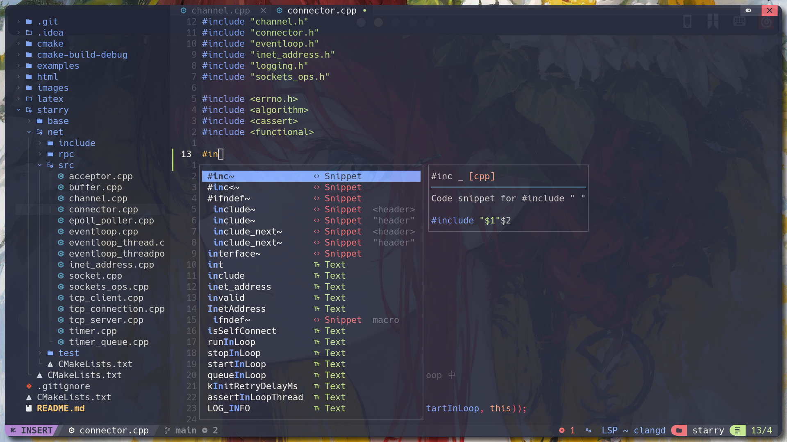

# Neovim Config

> Personal Neovim configuration based on [NvChad](https://nvchad.com/docs/quickstart/install/)



## Requirements

- [Neovim >= v0.11](https://github.com/neovim/neovim/releases)
- [ripgrep](https://github.com/BurntSushi/ripgrep) (Telescope live grep)
- [fd](https://github.com/sharkdp/fd) (Telescope file finder)
- [Rust](https://rust-lang.org/) (nvim-tree)

## Quick Start

### Arch Linux

```bash
sudo pacman -S neovim xclip cmake clang base-devel ripgrep fd git

mkdir -p ~/.config
git clone https://github.com/AidenYuanDev/nvim.git ~/.config/nvim
nvim
```

### Ubuntu / Debian

```bash
# Rust
curl --proto '=https' --tlsv1.2 -sSf https://sh.rustup.rs | sh

# Neovim (AppImage)
curl -LO https://github.com/neovim/neovim/releases/latest/download/nvim-linux-x86_64.appimage
chmod u+x nvim-linux-x86_64.appimage
sudo mv nvim-linux-x86_64.appimage /usr/bin/nvim

# Dependencies
sudo apt install xclip cmake clang build-essential ripgrep fd-find curl git

# fd-find binary is named fdfind on Ubuntu, create a symlink
ln -s $(which fdfind) ~/.local/bin/fd

mkdir -p ~/.config
git clone https://github.com/AidenYuanDev/nvim.git ~/.config/nvim
nvim
```

### CentOS / RHEL

```bash
# Rust
curl --proto '=https' --tlsv1.2 -sSf https://sh.rustup.rs | sh

# Neovim (AppImage)
curl -LO https://github.com/neovim/neovim/releases/latest/download/nvim-linux-x86_64.appimage
chmod u+x nvim-linux-x86_64.appimage
sudo mv nvim-linux-x86_64.appimage /usr/bin/nvim

# Dependencies
sudo dnf install xclip cmake clang gcc-c++ ripgrep fd-find curl git

mkdir -p ~/.config
git clone https://github.com/AidenYuanDev/nvim.git ~/.config/nvim
nvim
```
